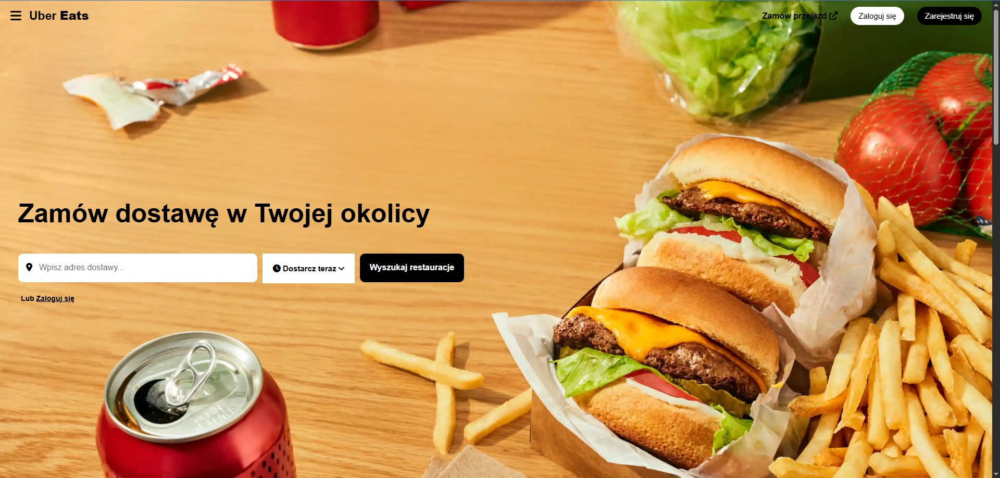
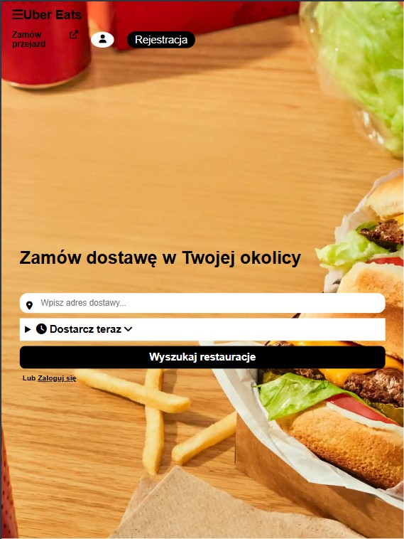
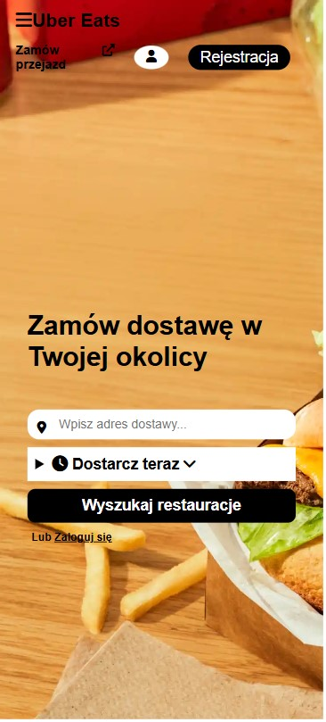

# Uber-Eats-Copy

## 🍔Opis:
Strona stanowi prostą kopię serwisu Uber Eats, stworzoną przy użyciu technologii front-endowych (HTML, CSS, JavaScript).

🔹 HTML

Odpowiada za strukturę strony – sekcje takie jak:

- nagłówek z logo i wyszukiwarką restauracji,

🔹 CSS

- Zapewnia stylizację i responsywność:

- nowoczesny wygląd inspirowany interfejsem Uber Eats,

- układ kart (grid/flexbox),

- animacje hover, efekt cienia i płynne przejścia,

- dostosowanie widoku do ekranów mobilnych i desktopowych.

🔹 JavaScript

- Odpowiada za interaktywność strony:

- walidacja formularza zamówienia i potwierdzenie zakupu.

  ## Zrzuty ekranów:
  ### desktop
   
  
   
   
  ### tablet
   
  
   
   
  ### phone
   
  
   
  

  

[Odwiedź strone](https://borowka231.github.io/Uber-Eats-Copy/)
